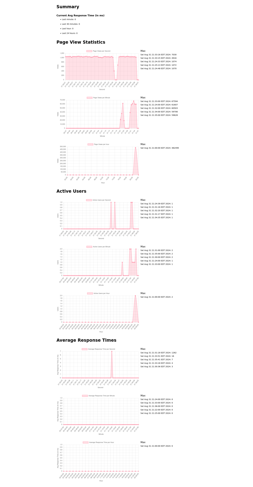

# treqmon

Request Monitoring for [twebserver](https://github.com/jerily/twebserver).

## Prerequisites

- [twebserver](https://github.com/jerily/twebserver) (version 1.47.53 and above)
- [valkey-tcl](https://github.com/jerily/valkey-tcl) (version 1.0.0 and above)

## Installation

```bash
# It installs to /usr/local/lib
# To install elsewhere, change the prefix
# e.g. make install PREFIX=/path/to/install
make install
```

## Usage

We split configuration in two parts: main and middleware.
The main part is needed for some stores and loggers
to be initialized in the main thread.
For example, if you are using the `memstore` store or the `console` logger,
they create the worker thread in the main thread and then pass it to the
middleware (twebserver) threads.

In main thread of your application:
```tcl
package require treqmon
set middleware_config [::treqmon::init_main $main_config]
```

In middleware threads of your application:
```tcl
package require treqmon

::treqmon::init_middleware $middleware_config

::twebserver::add_middleware \
    -enter_proc ::treqmon::middleware::enter \
    -leave_proc ::treqmon::middleware::leave \
    $router
```

## Configuration

The following are supported configuration options:

- **store** - The store to use and its configuration. For example:
```tcl
valkeystore {
    host localhost
    port 6379
}
```

- **logger** - The logger to use and its configuration. For example:
```tcl
logger {
    console {
        threshold 100
    }
    logfile {
        threshold 100
        path /var/log/treqmon.log
    }
}
```

where **threshold** is the number of events that have to be exceeded before the logger logs the events in bulk.

## Charts

The following are supported thtml components:

* [page_views_per_hour_chart.thtml](templates/page_views_per_hour_chart.thtml)
* [page_views_per_minute_chart.thtml](templates/page_views_per_minute_chart.thtml)
* [page_views_per_second_chart.thtml](templates/page_views_per_second_chart.thtml)
* [response_times_per_hour_chart.thtml](templates/response_times_per_hour_chart.thtml)
* [response_times_per_minute_chart.thtml](templates/response_times_per_minute_chart.thtml)
* [response_times_per_second_chart.thtml](templates/response_times_per_second_chart.thtml)
* [active_users_per_hour_chart.thtml](templates/active_users_per_hour_chart.thtml)
* [active_users_per_minute_chart.thtml](templates/active_users_per_minute_chart.thtml)
* [active_users_per_second_chart.thtml](templates/active_users_per_second_chart.thtml)
* [stats.thtml](templates/stats.thtml)
* [summary.thtml](templates/summary.thtml)

You can import them in your application after you install
[thtml](https://github.com/jerily/twebserver),
[chart.js](https://www.chartjs.org/),
and [purecss](https://purecss.io/) like this:
```html
<import name="Stats" src="@treqmon/stats.thtml" />

<html lang="en">
    <head>
        <meta charset="utf-8" />
        <meta name="viewport" content="width=device-width, initial-scale=1" />
        <bundle_css url_prefix="$bundle_css_url_prefix" />
    </head>
    <body>
        <Stats />
        <bundle_js url_prefix="$bundle_js_url_prefix">
            <!--
                ...
            -->
        </bundle_js>
    </body>
</html>
```

## Examples

See full example [here](example/app.tcl).

## Screenshots

